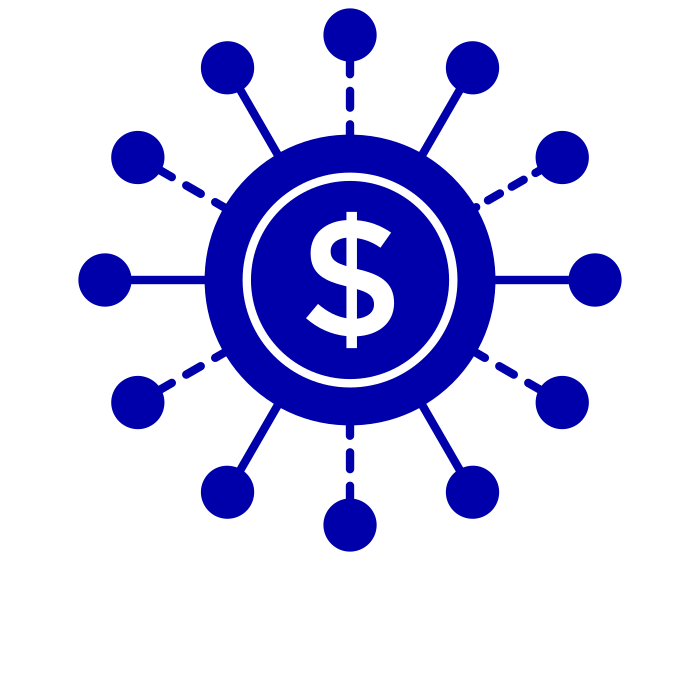
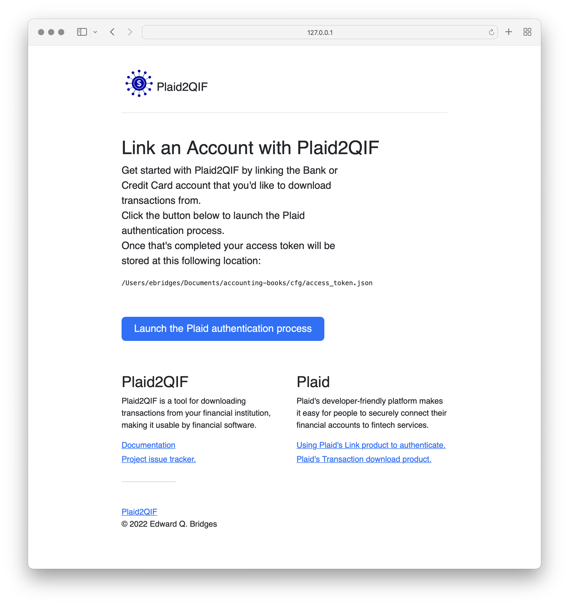

[](https://github.com/eqbridges/plaid2qif)

# Plaid2QIF Account Linker

In order to use Plaid2QIF you must grant Plaid2QIF authorization to access your financial institution's account on your behalf with via Plaid.  This is done by using this tool to log into your account and exchange credentials to obtian an "access token".

## Usage

**To Begin**
* Visit https://dashboard.plaid.com/overview/development and take note of your `client_id` and `secret`.
* Decide on a location where you want this service to write out the access token.

```
cd ./gen-access-token
cp sample.env .env

# update with your client_id & secret, and location for the token
vi .env

python server.py
open http://127.0.0.1:8080
```

## Screenshot



## Footnotes

* Visit https://dashboard.plaid.com/team/api and configure a redirect URL that corresponds to the value of `PLAID_SANDBOX_REDIRECT_URI`.  This only gets used if your financial institution relies on OAuth.  I've not tested this scenario, so if it doesn't work I'd appreciate your notes (or a PR) to fix it.

## Disclaimer

The access token generated by using this tool is sensitive material as it grants access to your accounts. It should be handled with care and protected from unauthorized access.

You must be sure to store it in such a way that makes it impossible for others to gain access.  The creators and maintainers of Plaid2QIF are in no way responsible if you mishandle your access token.
